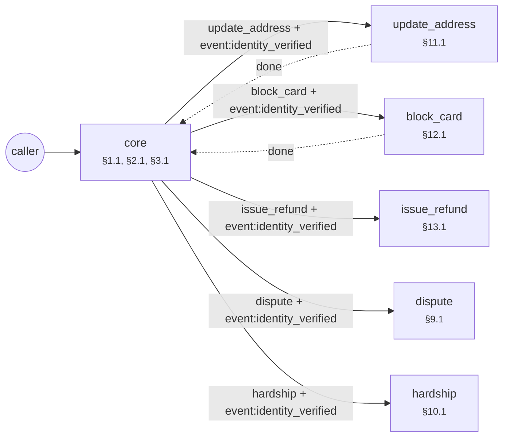

# Topology: example_mutual_insurance_overdue_premium_reminde

```mermaid
flowchart LR
    caller((caller)) --> core
    core["core<br/><small>§1.1, §2.1, §3.1</small>"]
    update_address["update_address<br/><small>§11.1</small>"]
    block_card["block_card<br/><small>§12.1</small>"]
    issue_refund["issue_refund<br/><small>§13.1</small>"]
    dispute["dispute<br/><small>§9.1</small>"]
    hardship["hardship<br/><small>§10.1</small>"]
    core -->|"update_address + event:identity_verified"| update_address
    update_address -.->|"done"| core
    core -->|"block_card + event:identity_verified"| block_card
    block_card -.->|"done"| core
    core -->|"issue_refund + event:identity_verified"| issue_refund
    core -->|"dispute + event:identity_verified"| dispute
    core -->|"hardship + event:identity_verified"| hardship
```
