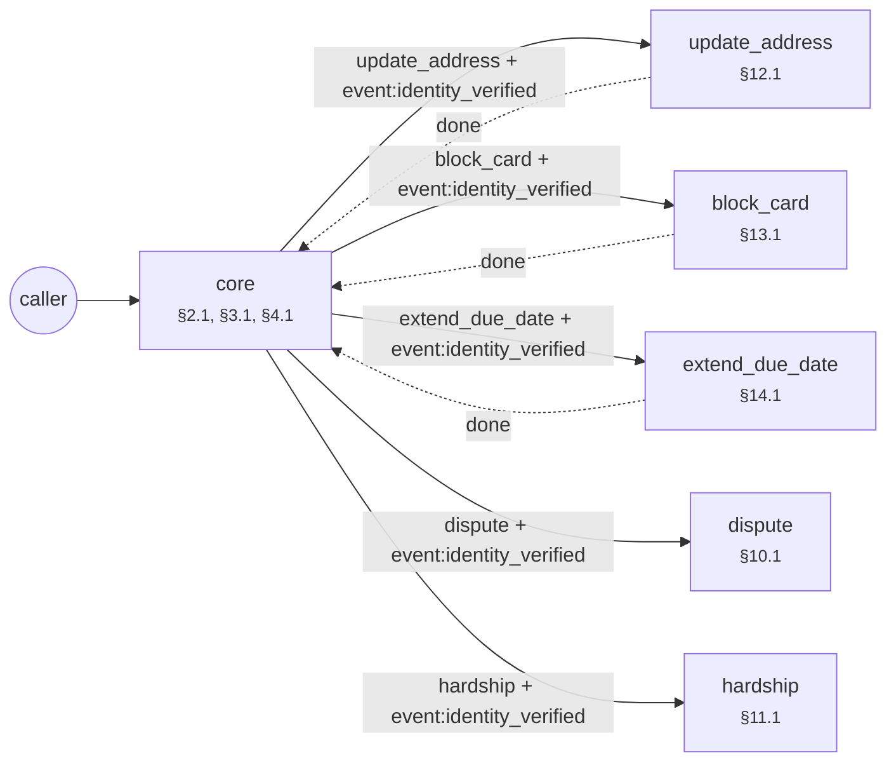

# Topology: ornek_banka_a_s_gecikmis_kredi_karti_borcu_tahsi

```mermaid
flowchart LR
    caller((caller)) --> core
    core["core<br/><small>§2.1, §3.1, §4.1</small>"]
    update_address["update_address<br/><small>§12.1</small>"]
    block_card["block_card<br/><small>§13.1</small>"]
    extend_due_date["extend_due_date<br/><small>§14.1</small>"]
    dispute["dispute<br/><small>§10.1</small>"]
    hardship["hardship<br/><small>§11.1</small>"]
    core -->|"update_address + event:identity_verified"| update_address
    update_address -.->|"done"| core
    core -->|"block_card + event:identity_verified"| block_card
    block_card -.->|"done"| core
    core -->|"extend_due_date + event:identity_verified"| extend_due_date
    extend_due_date -.->|"done"| core
    core -->|"dispute + event:identity_verified"| dispute
    core -->|"hardship + event:identity_verified"| hardship
```
